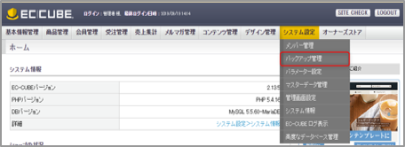
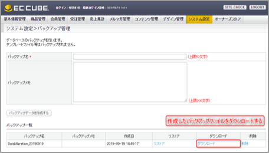
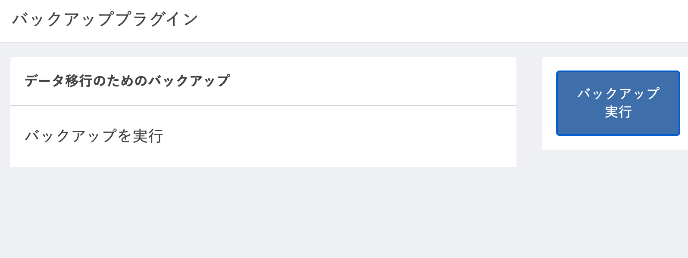
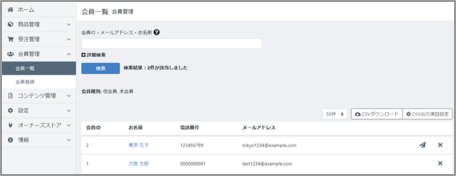
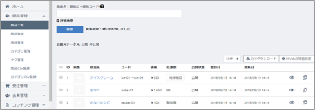
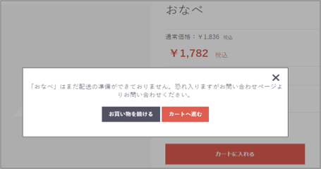

# データ移行プラグイン 移行マニュアル

- 作成日：2019年9月19日
- 更新日：2020年7月1日

# プラグイン概要

現在お使いのEC-CUBE2系・3系のデータをEC-CUBE4系の新しい環境に移行することができます。

移行可否 | 対象 | 備考
-- | -- | --
○ | 会員データ | ※メルマガの購読可否 / ※ポイントは2系のみ対応 
○ | 管理者データ |  
○ | 商品データ |  
○ | カテゴリデータ |  
○ | 受注データ | ※ポイントは2系のみ対応 
○ | 支払い方法 |  
○ | 配送方法 |  
○ | 税設定 |  
☓ | カート |  
☓ | 決済と配送の紐づけ |  
☓ | 複数配送 |  
☓ | ダウンロード商品の商品データ |  
☓ | ダウンロード商品の受注データ |  

> ※会員データを移行するにあたって、メルマガの購読可否を移行するには、データ移行の前に「メールマガジンプラグイン」を事前に導入いただく必要があります

> ※ポイントの移行は、現状2系のみ対応しています。今後3系にも対応予定です。

# 手順

## 1) EC-CUBE2系からバックアップファイル(~.tar.gz)を作成しダウンロードする

EC-CUBE2系をご利用の場合は、バックアップ管理からバックアップデータをダウンロードしてください。

## 2) EC-CUBE3系からバックアップファイル(~.tar.gz)を作成しダウンロードする

EC-CUBE3系をご利用の場合は、[EC-CUBE4系移行用バックアッププラグイン 3.0系](https://www.ec-cube.net/products/detail.php?product_id=2091) をインストールし、バックアップデータをダウンロードしてください。

## 3) EC-CUBE4系にデータ移行プラグインをインストールする

[参考：プラグイン一覧画面 | EC-CUBE4 管理・運用マニュアル](https://www.shiro8.net/manual4/v40x/store/plugin.html)

## 3) バックアップファイルをEC-CUBE4系にアップロードする

インストールしたデータ移行プラグインの設定画面に進む。

作成したバックアップファイルを選択し「Upload」をクリックする。

※バックアップファイルのサイズが上限値を超える場合は、「よくあるご質問」をご確認ください。

アップロードが完了すると以下のように「登録しました」と表示されます。

バックアップファイルをアップロード後、管理画面にはEC-CUBE2系・3系で使用していたログインIDとパスワードでログインできるようになります。

データ移行後、EC-CUBE4系の管理画面にログインできなくなったときは「よくあるご質問」をご確認ください。

# EC-CUBE4系に移行されたデータを確認する

## 会員データ

管理画面＞会員管理＞会員一覧から移行した会員データを確認します。

## 管理者データ

管理画面＞設定＞システム設定＞メンバー管理から移行した管理者データを確認します。

## 商品データ

管理画面＞商品管理＞商品一覧から移行した商品データを確認します。

※商品の画像の移行については、「よくあるご質問」を参照してください。

## カテゴリデータ

管理画面＞商品管理＞カテゴリ管理から移行した商品カテゴリを確認します。

## 支払い方法

管理画面＞設定＞店舗設定＞支払方法設定から移行した支払方法を確認します。

> ※支払い方法は、過去の受注を参照するために移行されています。「表示」に変更しても購入時に利用することができません。新規に支払い方法を作成してください。

## 配送方法

管理画面＞設定＞店舗設定＞配送方法設定から移行した配送方法を確認します。

移行した配送方法は「非表示」に設定されています。「表示する」に設定されるとショップで利用可能となります。

配送方法を「表示する」に設定するまで移行した商品をカートに入れることはできません。

## 税率設定

管理画面＞設定＞店舗設定＞税率設定から移行した税率設定を確認します。

# よくある質問

> 「ファイルのサイズが大きすぎます。有効な最大サイズは10 MiBです。　The file is too large. Allowed maximum size is 10 MiB.」

バックアップファイルのサイズがアップロードの上限サイズを超えている場合に発生します。※上限は環境によりことなります。

作成されたバックアップファイル（~.tar.gz）を展開し、以下のファイルを削除してみてください。

dtb_order_temp.csv

受注確定する前の購入プロセスにおいて情報を受け渡しするためのデータが保存されています。削除することで、データ移行への影響はありません。

dtb_session.csv

セッション情報が保存されています。削除することで、データ移行への影響はありません。

> データ移行後、管理画面にログインできない　

.envに登録されているECCUBE_AUTH_MAGICの値を、旧サイトのものに変更する必要があります。

以下の手順でECCUBE_AUTH_MAGICの値を変更してください。

EC-CUBE2系のAUTH_MAGICをコピーする。

※AUTH_MAGICの値は、以下の場所にあります。

2.4の場合：data/cache/mtb_constants.php

2.11以降：data/config/config.php

`define('AUTH_MAGIC', 'ここに入力されている文字列をコピーする');`

3.0の場合：app/config/eccube/config.yaml

`auth_magic: ここに入力されている文字列をコピーする`

EC-CUBE4系の.envに登録されているECCUBE_AUTH_MAGICをコピーした文字列に書き換える。

`ECCUBE_AUTH_MAGIC=コピーした文字列に置き換える`

> 商品画像を反映したい

データ移行プラグインでは、商品画像のレコードのみ移行されます。画像は別途配置する必要があります。

EC-CUBE2系のhtml/upload/save_image配下の画像ファイルをEC-CUBE4系のhtml/upload/save_imageに配置してください。

> 新サイトの構築期間中に発生した会員・受注情報を移行したい

データ移行プラグインのオプション「会員と受注のみ移行する」を利用し、バックアップデータをアップロードしてください。

通常は、関連データが初期化されますが、このオプションを利用した場合、関連データは初期化されず、会員・受注データのみ登録しなおすことができます。

> ポイントの移行について

ポイントの移行は、現在EC-CUBE2系のみ対応しています。
EC-CUBE3系は今後対応予定です。
